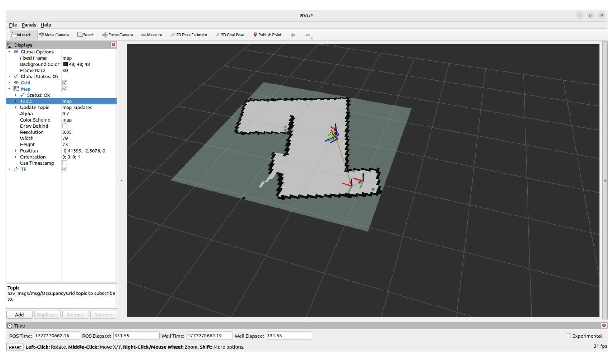

# ROS2 Challenge: Autonomous Security Patrol (TurtleBot3 Burger)

This project implements an autonomous patrol mission in ROS 2 (Humble) for TurtleBot3 Burger.
The robot navigates through predefined waypoints, inspects each location with camera-based vision, classifies findings as `authorized`, `intruder`, `empty`, or `stop_sign`, and visualizes detections in RViz.

## What the system does

- Navigates through a mission route using Nav2.
- At patrol waypoints, captures one frame and classifies scene status.
- Uses stop-sign checkpoints to change route dynamically:
  - Stop sign at waypoint `id=2` skips `id=3,4,5` and jumps to `id=6`.
  - Stop sign at waypoint `id=7` skips `id=8,9,10` and jumps to base `id=11`.
- Returns to base early when detected people reach threshold (`max_detected_people=4`).
- Publishes markers in RViz:
  - `intruder` -> red marker
  - `authorized` -> green marker
  - `empty` -> no marker
  - base (`id=11`) -> no marker
- Estimates marker position near walls using `/scan` + `/amcl_pose` (instead of dropping marker at robot pose).

## Repository structure

- `src/my_vision_pkg/my_vision_pkg/mission_node.py`  
  Mission state machine, waypoint navigation, stop-sign routing, marker placement.
- `src/yolo_detector/yolo_detector/gpt_vision_node.py`  
  Vision backend using OpenAI vision model via `/classify_current_frame` service.
- `src/yolo_detector/yolo_detector/yolo_node.py`  
  Alternative YOLO-based detector (kept in codebase).
- `src/yolo_detector/launch/yolo_launch.py`  
  Launches `gpt_vision_node` and remaps image topic input.
- `sample.py`  
  Local non-ROS sanity script for image classification with OpenAI.
- `dataset/`  
  Custom training dataset scaffold for YOLO experiments.

## Mission logic (current)

Waypoints are in `mission_node.py` with `id=11` as base.

1. Patrol starts at `id=1`.
2. At `id=2`, only stop-sign logic is relevant:
   - if `stop_sign`: skip `3,4,5` -> go `6`
   - else continue normal route
3. At `id=3,4,5,6,8,9,10`, classify `authorized/intruder/empty`.
4. At `id=7`, only stop-sign logic is relevant:
   - if `stop_sign`: skip `8,9,10` -> go `11`
5. `id=11` is base-only: navigation endpoint, no inspection, no marker.

## Prerequisites

- Ubuntu with ROS 2 Humble
- TurtleBot3 Burger robot + LiDAR + camera
- Nav2 stack running
- Python dependencies in `requirements.txt`

Install Python dependencies:

```bash
pip install -r requirements.txt
```

For GPT vision backend:

```bash
export OPENAI_API_KEY="<your_key>"
```

## Run (starting from vision + mission stage)

### On robot

```bash
ros2 launch turtlebot3_bringup robot.launch.py
ros2 launch turtlebot3_navigation2 navigation2.launch.py map:=/home/tb/tb_ws/src/tb3_launcher/maps/dyson_map_v2.yaml
ros2 launch camera_ros camera.launch.py
```

### RViz setup

Set fixed frame to `map` and add:

- `Map` topic `/map`
- `TF`
- `LaserScan` topic `/scan`
- `MarkerArray` topic `/detected_markers`
- `Image` topic `/camera/image_raw`

Set 2D pose.

### On laptop

Terminal 1 (vision backend):

```bash
source /opt/ros/humble/setup.bash
source ~/ros2_ws/install/setup.bash
ros2 launch yolo_detector yolo_launch.py
```

Terminal 2 (mission):

```bash
source /opt/ros/humble/setup.bash
source ~/ros2_ws/install/setup.bash
ros2 run my_vision_pkg mission_node
```

Optional monitor:

```bash
ros2 topic echo /vision_status
```

## Autonomous SLAM mapping (from PDF pages 5-7)

The autonomous SLAM procedure used in this project follows the sequence documented in the attached PDF.

Robot (SSH terminal):

```bash
ssh tb@10.32.42.46
ros2 launch turtlebot3_bringup robot.launch.py
```

Laptop terminal A (RViz):

```bash
rviz2
```

In RViz, add:

- `Map` (`/map`)
- `LaserScan` (`/scan`)
- `TF`
- `RobotModel`

Laptop terminal B (SLAM):

```bash
ros2 launch slam_toolbox online_async_launch.py
```

Initial movement/exploration:

- Set a 2D Nav Goal in RViz and let the robot move, or
- Use keyboard teleop (preferred):

```bash
ros2 run teleop_twist_keyboard teleop_twist_keyboard
```

Then launch autonomous exploration on laptop:

```bash
ros2 launch nav2_bringup navigation_launch.py use_sim_time:=False
ros2 launch explore_lite explore.launch.py costmap_topic:=/global_costmap/costmap
```

Save map when done:

```bash
ros2 run nav2_map_server map_saver_cli -f /home/tb/tb_ws/src/tb3_launcher/maps/dyson_map_auto
```

RViz screenshot from this project:



## Vision label mapping

The operational mapping is:

- `military`, `worker`, `security personnel` -> `intruder`
- `student`, `researcher`, `lab assistant` -> `authorized`
- `stop sign` -> `stop_sign`
- anything else -> `empty`

## Local vision sanity test (no ROS)

```bash
export OPENAI_API_KEY="<your_key>"
python3 sample.py --source dataset/images/val --model gpt-4.1-mini
```

## Notes and known constraints

- Marker wall projection is LiDAR-based and uses nearest valid frontal scan beam.
- If `/scan` or `/amcl_pose` is unavailable, marker placement falls back to waypoint position.
- Compressed camera topics are not directly consumed by current nodes (`sensor_msgs/Image` expected).

## REBUILD PACKAGES on laptop

If you changed only .py code

```bash
cd ~/ros2_ws
rm -rf build install log
colcon build
source /opt/ros/humble/setup.bash
source ~/ros2_ws/install/setup.bash
```

After rebuilding, verify it exists:

```bash
ros2 pkg executables my_vision_pkg
ros2 pkg executables yolo_detector
```

## REBUILD on the robot
```bash
colcon build --symlink-install --packages-up-to tb3_launcher
```

## Future improvements

- Camera-pixel + LiDAR angle fusion for tighter marker placement.
- Replace hardcoded waypoint list with YAML config loading.
